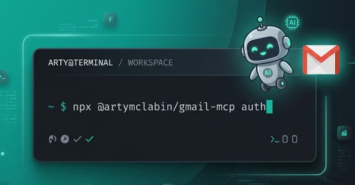

# Gmail MCP Server (Actively Maintained Fork)

**Installation:** `npx @artymclabin/gmail-mcp auth` - or just tell your Claude to install the MCP from this repo (`https://github.com/ArtyMcLabin/Gmail-MCP-Server`) and let it set up. Prefer manual steps? See [Installation & Authentication](#installation--authentication).

[](https://github.com/ArtyMcLabin/Gmail-MCP-Server/actions/workflows/ci.yml) [](https://www.npmjs.com/package/@artymclabin/gmail-mcp)

Also on the [official MCP Registry](https://registry.modelcontextprotocol.io) (`io.github.ArtyMcLabin/Gmail-MCP-Server`) and [Smithery](https://smithery.ai/servers/rawceo/gmail-mcp).

> **This is an actively maintained fork of [GongRzhe/Gmail-MCP-Server](https://github.com/GongRzhe/Gmail-MCP-Server).**
>
> The original repository has been unmaintained since August 2025 - 7+ months with zero maintainer activity and 72+ unmerged pull requests. I use this MCP server daily as part of my Claude Code workflow and depend on it working correctly, so I picked it up.
>
> **Pull requests are welcome.** If you've been sitting on fixes or features with nowhere to submit them, this is the place.

## Philosophy

This fork is **lean and pragmatic**. It supports local stdio use and a self-hosted Streamable HTTP deployment. Remote mode fails closed, persists connector OAuth state, and assumes one trusted operator rather than an untrusted multi-tenant service. Dependencies and operational state are kept explicit and bounded.

There's a downstream fork that took this in the **maximalist** direction. I'm not affiliated with its maintainer and I don't track its security or features - use it at your own risk: **[klodr/gmail-mcp](https://github.com/klodr/gmail-mcp)**. If that's the philosophy you want, go check it out. PRs welcome here as always.

### What this fork adds

- **Fixed reply threading** - auto-resolves `In-Reply-To` and `References` headers so email replies land in the correct thread instead of creating orphaned messages ([upstream PR #91](https://github.com/GongRzhe/Gmail-MCP-Server/pull/91), still pending)
- **Send-as alias support** - optional `from` parameter for multi-identity email management (send from any configured Gmail alias)
- **Reply-all tool** - `reply_all` automatically fetches the original email, builds To/CC recipient lists (excluding yourself), and sets proper threading headers ([PR #3](https://github.com/ArtyMcLabin/Gmail-MCP-Server/pull/3) by [@MaxGhenis](https://github.com/MaxGhenis))
- **Fixed `list_filters`** - was returning empty array due to wrong response property name ([PR #4](https://github.com/ArtyMcLabin/Gmail-MCP-Server/pull/4) by [@nicholas-anthony-ai](https://github.com/nicholas-anthony-ai))
- **Custom OAuth2 scoping** - `--scopes` flag to request only the permissions you need, with automatic tool filtering ([PR #6](https://github.com/ArtyMcLabin/Gmail-MCP-Server/pull/6) by [@tansanDOTeth](https://github.com/tansanDOTeth))
- **CI/CD hardening** - fixed shell injection vector in GitHub Actions workflow, added least-privilege permissions scope ([PR #9](https://github.com/ArtyMcLabin/Gmail-MCP-Server/pull/9) by [@JF10R](https://github.com/JF10R))
- **Security hardening** - fixed path traversal in attachment download, restricted OAuth credential file permissions ([PR #10](https://github.com/ArtyMcLabin/Gmail-MCP-Server/pull/10) by [@JF10R](https://github.com/JF10R))
- **Dependency security** - upgraded MCP SDK to v1.27.1 (3 CVE fixes), upgraded nodemailer (DoS + routing fix), moved dev-only packages out of production deps ([PR #11](https://github.com/ArtyMcLabin/Gmail-MCP-Server/pull/11) by [@JF10R](https://github.com/JF10R))
- **Thread-level tools** - `get_thread`, `list_inbox_threads`, `get_inbox_with_threads`, `modify_thread` for efficient thread-based email operations in a single call
- **CC/BCC visibility** - `read_email` now shows CC and BCC headers when present ([PR #21](https://github.com/ArtyMcLabin/Gmail-MCP-Server/pull/21) by [@panghy](https://github.com/panghy))
- **Phishing report tools** - `report_phishing` and `batch_report_phishing` for marking messages as spam via the Gmail API ([PR #24](https://github.com/ArtyMcLabin/Gmail-MCP-Server/pull/24) by [@ShivamB25](https://github.com/ShivamB25))
- **Draft lifecycle tools** - `send_draft`, `delete_draft`, `update_draft` close the orphan-draft gap: `send_draft` atomically sends an existing draft and removes it from Drafts (no ghost copy); `update_draft` mutates a draft in place preserving its ID (no draft pile-up across iteration loops); `delete_draft` discards an abandoned draft ([PR #30](https://github.com/ArtyMcLabin/Gmail-MCP-Server/pull/30) by [@thisisambros](https://github.com/thisisambros))
- **Tool annotations** - MCP spec annotations (`readOnlyHint`, `destructiveHint`, `idempotentHint`) on all tools for safer LLM tool execution ([PR #14](https://github.com/ArtyMcLabin/Gmail-MCP-Server/pull/14) by [@bryankthompson](https://github.com/bryankthompson))
- **Download email tool** - `download_email` saves emails to disk in json/eml/txt/html formats without consuming LLM context ([PR #13](https://github.com/ArtyMcLabin/Gmail-MCP-Server/pull/13) by [@icanhasjonas](https://github.com/icanhasjonas))
- **Durable OAuth sessions** - `refresh_token` is persisted across restarts, ending the hourly re-auth loop ([PR #35](https://github.com/ArtyMcLabin/Gmail-MCP-Server/pull/35) by [@BrentBaccala](https://github.com/BrentBaccala))
- **Custom OAuth callback port** - the auth listener derives port and path from your callback URL instead of hardcoding 3000 ([PR #41](https://github.com/ArtyMcLabin/Gmail-MCP-Server/pull/41) by [@soapergem](https://github.com/soapergem))
- **Safe permanent-delete gating** - `delete_email`/`batch_delete_emails` require the opt-in `gmail.full` scope (which also satisfies all other mail scopes), so default auth stays least-privilege ([PR #39](https://github.com/ArtyMcLabin/Gmail-MCP-Server/pull/39) by [@caioribeiroclw-pixel](https://github.com/caioribeiroclw-pixel))
- **Durable remote MCP** - Streamable HTTP, OAuth dynamic registration/PKCE, rotating refresh tokens, bounded request handling, and restart-safe connector state
- **Managed files** - attachment imports and downloads stay inside bounded managed roots with traversal, symlink, hardlink, and file-change checks
- **Crash-safe scheduling** - one scheduler lease, durable claims, owner-bound attachment spools, and explicit reconciliation for uncertain sends

All features are production-tested in daily use.

[](https://star-history.com/#ArtyMcLabin/Gmail-MCP-Server&Date)

---

A Model Context Protocol (MCP) server for Gmail integration in Claude Desktop with auto authentication support. This server enables AI assistants to manage Gmail through natural language interactions.


## Features

- Send emails with subject, content, **managed attachments**, inline images, and recipients
- **Managed attachment support** - send files from managed imports and receive files into managed exports
- **Download email attachments** into the managed export library
- **Download full emails** into managed exports in json/eml/txt/html formats
- **Thread-level operations** - get full threads, list inbox threads, batch-expand threads
- Support for HTML emails and multipart messages with both HTML and plain text versions
- Full support for international characters in subject lines and email content
- Read email messages by ID with advanced MIME structure handling
- **Enhanced attachment display** showing filenames, types, sizes, and download IDs
- Search emails with various criteria (subject, sender, date range)
- **Comprehensive label management with ability to create, update, delete and list labels**
- List all available Gmail labels (system and user-defined)
- List emails in inbox, sent, or custom labels
- Mark emails as read/unread
- Move emails to different labels/folders
- Delete emails
- **Batch operations for efficiently processing multiple emails at once**
- Full integration with Gmail API
- Simple OAuth2 authentication flow with auto browser launch
- Support for both Desktop and Web application credentials
- Global credential storage for convenience

## Installation & Authentication

### Installing from npm (recommended)

```bash
npx @artymclabin/gmail-mcp auth
```

### Installing from source

Node.js 24 or newer is required because the persistent remote OAuth state uses
the built-in `node:sqlite` module.

```bash
git clone https://github.com/ArtyMcLabin/Gmail-MCP-Server.git
cd Gmail-MCP-Server
npm install
npm run build
```

> **Note**: The `npx @gongrzhe/server-gmail-autoauth-mcp` commands found in older docs reference the [unmaintained upstream fork](https://github.com/GongRzhe/Gmail-MCP-Server). This fork is published as [`@artymclabin/gmail-mcp`](https://www.npmjs.com/package/@artymclabin/gmail-mcp).

### Setting up Google Cloud credentials

1. Create a Google Cloud Project and obtain credentials:

   a. Create a Google Cloud Project:
      - Go to [Google Cloud Console](https://console.cloud.google.com/)
      - Create a new project or select an existing one
      - Enable the Gmail API for your project

   b. Create OAuth 2.0 Credentials:
      - Go to "APIs & Services" > "Credentials"
      - Click "Create Credentials" > "OAuth client ID"
      - Choose either "Desktop app" or "Web application" as application type
      - Give it a name and click "Create"
      - For Web application, add the callback URL you will use:
        - Local auth: `http://localhost:3000/oauth2callback`
        - Remote MCP auth: your fixed public URL plus `/oauth2callback`, e.g. `https://mcp.example.com/oauth2callback`
      - Download the JSON file of your client's OAuth keys
      - Rename the key file to `gcp-oauth.keys.json`

2. Run Authentication:

   You can authenticate in two ways:

   a. Global Authentication (Recommended):
   ```bash
   # First time: Place gcp-oauth.keys.json in your home directory's .gmail-mcp folder
   mkdir -p ~/.gmail-mcp
   mv gcp-oauth.keys.json ~/.gmail-mcp/

   # Run authentication from anywhere
   node dist/index.js auth
   ```

   b. Local Authentication:
   ```bash
   # Place gcp-oauth.keys.json in your current directory
   # The file will be automatically copied to global config
   node dist/index.js auth
   ```

   The authentication process will:
   - Look for `gcp-oauth.keys.json` in the current directory or `~/.gmail-mcp/`
   - If found in current directory, copy it to `~/.gmail-mcp/`
   - Open your default browser for Google authentication
   - Save credentials as `~/.gmail-mcp/credentials.json`

   > **Note**: 
   > - After successful authentication, credentials are stored globally in `~/.gmail-mcp/` and can be used from any directory
   > - Both Desktop app and Web application credentials are supported
   > - For Web application credentials, make sure every callback URL you use is listed in Google Cloud authorized redirect URIs

   **Custom callback URL / port:** By default the local OAuth server listens on port `3000` at `/oauth2callback`. If port 3000 is unavailable, or you need a different redirect URI, pass a full callback URL as an argument. The listener automatically binds to the port and path from that URL:

   ```bash
   node dist/index.js auth http://localhost:8080/oauth2callback
   ```

   The URL you pass must exactly match one of the authorized redirect URIs registered in the Google Cloud Console.

3. Configure in Claude Desktop:

```json
{
  "mcpServers": {
    "gmail": {
      "command": "node",
      "args": [
        "/absolute/path/to/Gmail-MCP-Server/dist/index.js"
      ]
    }
  }
}
```

### Docker Support

The image uses Node.js 24, runs as an unprivileged user, and keeps mutable state
under `/var/lib/gmail-mcp`.

For a durable remote HTTP deployment, Compose starts the server on loopback port
8080, persists state and configuration in named volumes, and stages the Google
OAuth JSON with mode `0640` before the unprivileged server starts:

```bash
oauth_keys="$(realpath /path/to/gcp-oauth.keys.json)"
api_key="$(openssl rand -hex 32)"
umask 077
cat >.env <<EOF
GMAIL_OAUTH_KEYS_PATH=${oauth_keys}
GMAIL_MCP_PUBLIC_ORIGIN=https://mcp.example.com
GMAIL_MCP_BASE_PATH=
GMAIL_MCP_API_KEY=${api_key}
GMAIL_MCP_OAUTH_CALLBACKS=https://claude.ai/api/mcp/auth_callback
GMAIL_MCP_BIND_ADDRESS=127.0.0.1
GMAIL_MCP_HTTP_PORT=8080
EOF
docker compose up --detach --build
docker compose ps
```

The MCP endpoint is `https://mcp.example.com/mcp`; put a TLS reverse proxy in
front of the loopback listener. Re-running `docker compose up --detach` copies
an updated OAuth JSON into the configuration volume. `docker compose down`
preserves both volumes; adding `--volumes` deletes credentials, connector OAuth
state, and the staged Google OAuth configuration.

1. Authentication:
```bash
docker run -i --rm \
  --mount type=bind,source=/path/to/gcp-oauth.keys.json,target=/etc/gmail-mcp/gcp-oauth.keys.json,readonly \
  -v mcp-gmail:/var/lib/gmail-mcp \
  -e GMAIL_OAUTH_LISTEN_HOST=0.0.0.0 \
  -p 127.0.0.1:3000:3000 \
  mcp/gmail auth
```

2. Usage:
```json
{
  "mcpServers": {
    "gmail": {
      "command": "docker",
      "args": [
        "run",
        "-i",
        "--rm",
        "-v",
        "mcp-gmail:/var/lib/gmail-mcp",
        "--mount",
        "type=bind,source=/path/to/gcp-oauth.keys.json,target=/etc/gmail-mcp/gcp-oauth.keys.json,readonly",
        "mcp/gmail"
      ]
    }
  }
}
```

The image defaults to stdio. For remote Streamable HTTP, provide the explicit
HTTP command and required front-door OAuth settings:

```bash
docker run --rm \
  -p 127.0.0.1:8080:8080 \
  -v mcp-gmail:/var/lib/gmail-mcp \
  --mount type=bind,source=/path/to/gcp-oauth.keys.json,target=/etc/gmail-mcp/gcp-oauth.keys.json,readonly \
  -e GMAIL_MCP_PUBLIC_ORIGIN=https://mcp.example.com \
  -e GMAIL_MCP_API_KEY="$(openssl rand -hex 32)" \
  -e GMAIL_MCP_OAUTH_CALLBACKS=https://claude.ai/api/mcp/auth_callback \
  mcp/gmail --http --host=0.0.0.0 --port=8080
```

### Cloud Server Authentication

For cloud server environments (like n8n), you can specify a custom callback URL during CLI authentication:

```bash
node dist/index.js auth https://gmail.gongrzhe.com/oauth2callback
```

#### Setup Instructions for Cloud Environment

1. **Configure Reverse Proxy:**
   - Set up your n8n container to expose a port for authentication
   - Configure a reverse proxy to forward traffic from your domain (e.g., `gmail.gongrzhe.com`) to this port

2. **DNS Configuration:**
   - Add an A record in your DNS settings to resolve your domain to your cloud server's IP address

3. **Google Cloud Platform Setup:**
   - In your Google Cloud Console, add your custom domain callback URL (e.g., `https://gmail.gongrzhe.com/oauth2callback`) to the authorized redirect URIs list

4. **Run Authentication:**
   ```bash
   node dist/index.js auth https://gmail.gongrzhe.com/oauth2callback
   ```

For a remote MCP server used from Claude/Cowork, place a Web application OAuth JSON in the state directory and configure the public endpoint explicitly:

```bash
export GMAIL_MCP_STATE_DIR="$HOME/.gmail-mcp"
export GMAIL_MCP_PUBLIC_ORIGIN="https://mcp.example.com"
export GMAIL_MCP_BASE_PATH=""  # Use a prefix such as /gmail when sharing a hostname.
export GMAIL_MCP_API_KEY="replace-with-a-long-random-secret"
export GMAIL_MCP_OAUTH_CALLBACKS="https://claude.ai/api/mcp/auth_callback"
node dist/index.js --http --host=127.0.0.1 --port=8080
```

Version 2 uses MCP Streamable HTTP at `/mcp`. The former `--sse` command-line
flag remains as a deprecated alias for `--http`, but the legacy `/sse` and
`/messages` endpoints return HTTP 410. Existing remote connectors must be
reconfigured to use `${GMAIL_MCP_PUBLIC_ORIGIN}${GMAIL_MCP_BASE_PATH}/mcp`.

Remote mode fails closed if the public origin, API key, or redirect allowlist is missing. The API key is accepted only by the browser authorization form; MCP requests require issued OAuth access tokens. Connector clients, authorization codes, hashed tokens, and pending Google callbacks persist in `state.sqlite3` under `GMAIL_MCP_STATE_DIR`. Dynamic registrations are deduplicated, size/rate/capacity bounded, and expired; refresh tokens rotate with replay-family revocation and an OAuth revocation endpoint.

Scheduled email queue changes are locked across processes and replaced atomically. The scheduler durably claims a message before calling Gmail. If the process stops or Gmail's response is indeterminate, the record becomes `uncertain` and is never sent again automatically; inspect that status before deciding on any manual retry.

`GMAIL_MCP_PUBLIC_URL` remains supported for compatibility and may contain the complete MCP URL, such as `https://mcp.example.com/gmail/mcp`. With the new settings, the equivalent configuration is `GMAIL_MCP_PUBLIC_ORIGIN=https://mcp.example.com` and `GMAIL_MCP_BASE_PATH=/gmail`.

Add `${GMAIL_MCP_PUBLIC_ORIGIN}${GMAIL_MCP_BASE_PATH}/oauth2callback` to the authorized redirect URIs of the Google Web OAuth client. Then call the `authenticate_account` MCP tool; it returns a Google authorization URL and the server handles the callback at that exact path.

5. **Configure in your application:**
   ```json
   {
     "mcpServers": {
       "gmail": {
         "command": "node",
         "args": [
           "/absolute/path/to/Gmail-MCP-Server/dist/index.js"
         ]
       }
     }
   }
   ```

This approach allows authentication flows to work properly in environments where localhost isn't accessible, such as containerized applications or cloud servers.

## Ubuntu Service Deployment

For a durable Ubuntu 24.04 or 26.04 service installation, use the self-contained
[deployment bundle](deploy/README.md). It installs from this repository alone,
keeps releases, configuration, and runtime state in documented system paths,
and includes systemd units, optional fixed-domain ngrok ingress, Nginx templates,
encrypted backup/restore, staged VM migration, and authenticated HTTP checks.

The standalone mode can run on its own VM without another MCP repository. Shared
Nginx mode emits only a route include, so this server can coexist with another
application while retaining separate services, state, backups, and migration
procedures. Use a fixed ingress domain for persistent remote connectors; quick
tunnel URLs are not stable across restarts.

## OAuth Scopes

You can limit the server's Gmail access by specifying OAuth scopes during authentication. This controls which tools are available to the LLM, reducing the attack surface for sensitive operations.

### Available Scopes

| Scope | Description |
|-------|-------------|
| `gmail.readonly` | Read-only access to emails (search, read, download attachments) |
| `gmail.modify` | Read/write mailbox access (superset of `readonly`; does not authorize permanent deletion) |
| `gmail.compose` | Create drafts and send emails only |
| `gmail.send` | Send emails only |
| `gmail.labels` | Manage labels only |
| `gmail.full` | Full mailbox access, including permanent deletion; opt in explicitly |
| `gmail.settings.basic` | Manage filters and settings |

> **Note**: `gmail.modify` is a superset that includes all read capabilities. You don't need `gmail.readonly` if you have `gmail.modify`.

### Authenticating with Specific Scopes

Use the `--scopes` flag to request only the permissions you need:

```bash
# Read-only access (recommended for safe browsing)
node dist/index.js auth --scopes=gmail.readonly

# Read-only with filter management
node dist/index.js auth --scopes=gmail.readonly,gmail.settings.basic

# Default read/write and settings access (no permanent deletion)
node dist/index.js auth --scopes=gmail.modify,gmail.compose,gmail.send,gmail.settings.basic
```

If no `--scopes` flag is provided, the server defaults to `gmail.modify,gmail.compose,gmail.send,gmail.settings.basic` for full functionality.

### Scope-to-Tool Mapping

The server automatically filters available tools based on your authorized scopes:

| Tools | Required Scope (any) |
|-------|---------------------|
| `read_email`, `search_emails`, `download_attachment` | `gmail.readonly` or `gmail.modify` |
| `list_email_labels` | `gmail.readonly`, `gmail.modify`, or `gmail.labels` |
| `send_email`, `draft_email`, `reply_all`, `send_draft` | `gmail.modify`, `gmail.compose`, or `gmail.send` |
| `delete_draft`, `update_draft` | `gmail.modify` or `gmail.compose` |
| `modify_email`, `batch_modify_emails`, `modify_thread`, `report_phishing`, `batch_report_phishing` | `gmail.modify` |
| `delete_email`, `batch_delete_emails` | `gmail.full` (`https://mail.google.com/`) |
| `create_label`, `update_label`, `delete_label`, `get_or_create_label` | `gmail.modify` or `gmail.labels` |
| `list_filters`, `get_filter`, `create_filter`, `delete_filter`, `create_filter_from_template` | `gmail.settings.basic` |

`gmail.full` is intentionally separate from the default scopes because it grants permanent-delete capability. Prefer `modify_email` / `batch_modify_emails` for archive, mark-read, label, or inbox cleanup flows; re-authenticate with `--scopes=gmail.full,gmail.settings.basic` only when the assistant should be able to permanently delete mail. `gmail.full` is a superset of the other mail scopes, so that combination keeps every read/send/modify/label tool available (settings scopes remain separate - Gmail's filter endpoints only accept `gmail.settings.*`).

### Re-authenticating

To change your scopes, simply run the auth command again with different scopes. This will replace your existing credentials.

## Claude Code CLI Configuration

To use this MCP server with [Claude Code](https://docs.anthropic.com/en/docs/claude-code), add it to your MCP settings.

### Read-Only Configuration (Recommended for Safe Browsing)

First, authenticate with read-only scope:

```bash
node dist/index.js auth --scopes=gmail.readonly
```

Then add to your Claude Code MCP settings (`~/.claude/mcp_settings.json` or project-level `.mcp.json`):

```json
{
  "mcpServers": {
    "gmail": {
      "command": "npx",
      "args": ["/absolute/path/to/Gmail-MCP-Server/dist/index.js"]
    }
  }
}
```

With read-only scopes, only these 4 tools will be available to Claude:
- `read_email` - Read email content
- `search_emails` - Search your inbox
- `list_email_labels` - List available labels
- `download_attachment` - Download attachments

### Full Access Configuration

For full Gmail management capabilities:

```bash
node dist/index.js auth --scopes=gmail.modify,gmail.settings.basic
```

```json
{
  "mcpServers": {
    "gmail": {
      "command": "npx",
      "args": ["/absolute/path/to/Gmail-MCP-Server/dist/index.js"]
    }
  }
}
```

This enables every tool covered by the default scopes. The two permanent-delete tools remain hidden unless the account is re-authenticated with `gmail.full`.

### Running multiple instances (tool-name prefix)

Some MCP clients dedupe tool entries by their base name across servers, which makes it impossible to run two instances of this server side-by-side (e.g. one for a personal account and one for a shared inbox) - only one instance's tools surface, even though both servers report as connected.

The server accepts an optional `--tool-prefix=<value>` CLI flag (or `GMAIL_MCP_TOOL_PREFIX` env var) that is prepended to every tool name at registration. Default is empty (fully backward-compatible).

Example: register two instances with distinct prefixes in Claude Code:

```bash
# Personal account
claude mcp add gmail-personal -s user \
  -e GMAIL_CREDENTIALS_PATH=$HOME/.gmail-mcp/credentials-personal.json \
  -- node /absolute/path/to/Gmail-MCP-Server/dist/index.js --tool-prefix=personal_

# Shared inbox
claude mcp add gmail-info -s user \
  -- node /absolute/path/to/Gmail-MCP-Server/dist/index.js --tool-prefix=info_
```

Tools then surface as `mcp__gmail-personal__personal_search_emails`, `mcp__gmail-info__info_search_emails`, etc. - distinct at every layer. When a prefix is configured, calls must use that prefix; hidden unprefixed or unknown names are rejected.

The `auth` subcommand runs before the server starts and is unaffected - invoke it without `--tool-prefix`.

## Available Tools

The server provides the following tools that can be used through Claude Desktop:

File inputs are constrained to `${GMAIL_MCP_STATE_DIR:-~/.gmail-mcp}/files/imports` and `files/exports`. Relative attachment and inline-image paths resolve under `files/imports`; place files there before calling a send, draft, reply, or scheduling tool. Downloads are written under `files/exports`. A message may contain at most 10 combined attachment/inline MIME parts and 25 MiB of decoded file data.

### 1. Send Email (`send_email`)

Sends a new email immediately. Supports plain text, HTML, or multipart emails **with optional file attachments and inline images**.

Basic Email:
```json
{
  "to": ["recipient@example.com"],
  "subject": "Meeting Tomorrow",
  "body": "Hi,\n\nJust a reminder about our meeting tomorrow at 10 AM.\n\nBest regards",
  "cc": ["cc@example.com"],
  "bcc": ["bcc@example.com"],
  "mimeType": "text/plain"
}
```

**Email with Attachments:**
```json
{
  "to": ["recipient@example.com"],
  "subject": "Project Files",
  "body": "Hi,\n\nPlease find the project files attached.\n\nBest regards",
  "attachments": [
    "project/document.pdf",
    "project/spreadsheet.xlsx",
    "project/presentation.pptx"
  ]
}
```

HTML Email Example:
```json
{
  "to": ["recipient@example.com"],
  "subject": "Meeting Tomorrow",
  "mimeType": "text/html",
  "body": "<html><body><h1>Meeting Reminder</h1><p>Just a reminder about our <b>meeting tomorrow</b> at 10 AM.</p><p>Best regards</p></body></html>"
}
```

Multipart Email Example (HTML + Plain Text):
```json
{
  "to": ["recipient@example.com"],
  "subject": "Meeting Tomorrow",
  "mimeType": "multipart/alternative",
  "body": "Hi,\n\nJust a reminder about our meeting tomorrow at 10 AM.\n\nBest regards",
  "htmlBody": "<html><body><h1>Meeting Reminder</h1><p>Just a reminder about our <b>meeting tomorrow</b> at 10 AM.</p><p>Best regards</p></body></html>"
}
```

**Inline Images (embedded in HTML):**

Embed images inside the HTML body so they render in place, instead of arriving as separate attachments. Reference each image from `htmlBody` by its `cid`, and supply it as a managed import `path` or strictly encoded base64 `content`. Works the same way on `draft_email`, `update_draft`, `reply_all`, and scheduled email. Base64 images are limited to 10 MiB each and 20 MiB combined.

```json
{
  "to": ["recipient@example.com"],
  "subject": "Quarterly Report",
  "body": "Revenue is up. See the chart below.",
  "htmlBody": "<p>Revenue is up:</p>",
  "inlineImages": [
    { "cid": "chart1", "path": "charts/chart.png" }
  ]
}
```

### 2. Draft Email (`draft_email`)
Creates a draft email without sending it. **Also supports attachments**.

```json
{
  "to": ["recipient@example.com"],
  "subject": "Draft Report",
  "body": "Here's the draft report for your review.",
  "cc": ["manager@example.com"],
  "attachments": ["drafts/draft_report.docx"]
}
```

### 3. Read Email (`read_email`)
Retrieves the content of a specific email by its ID. **Now shows enhanced attachment information**.

```json
{
  "messageId": "182ab45cd67ef"
}
```

**Enhanced Response includes CC/BCC headers (when present) and attachment details:**
```
Subject: Project Files
From: sender@example.com
To: recipient@example.com
CC: colleague@example.com
Date: Thu, 19 Jun 2025 10:30:00 -0400

Email body content here...

Attachments (2):
- document.pdf (application/pdf, 245 KB, ID: ANGjdJ9fkTs-i3GCQo5o97f_itG...)
- spreadsheet.xlsx (application/vnd.openxmlformats-officedocument.spreadsheetml.sheet, 89 KB, ID: BWHkeL8gkUt-j4HDRp6o98g_juI...)
```

### 4. **Download Attachment (`download_attachment`)**
Downloads email attachments into the managed export library.

```json
{
  "messageId": "182ab45cd67ef",
  "attachmentId": "ANGjdJ9fkTs-i3GCQo5o97f_itG...",
  "savePath": "downloads",
  "filename": "downloaded_document.pdf"
}
```

Parameters:
- `messageId`: The ID of the email containing the attachment
- `attachmentId`: The attachment ID (shown in enhanced email display)
- `savePath`: Subdirectory under managed exports (optional; defaults to the export root)
- `filename`: Custom filename (optional, uses original filename if not provided)

### 5. Search Emails (`search_emails`)
Searches for emails using Gmail search syntax.

```json
{
  "query": "from:sender@example.com after:2024/01/01 has:attachment",
  "maxResults": 10
}
```

### 6. Modify Email (`modify_email`)
Adds or removes labels from emails (move to different folders, archive, etc.).

```json
{
  "messageId": "182ab45cd67ef",
  "addLabelIds": ["IMPORTANT"],
  "removeLabelIds": ["INBOX"]
}
```

### 7. Delete Email (`delete_email`)
Permanently deletes an email. This tool requires `gmail.full` (`https://mail.google.com/`); the default `gmail.modify` scope is not enough for Gmail's permanent-delete endpoint.

```json
{
  "messageId": "182ab45cd67ef"
}
```

### 8. List Email Labels (`list_email_labels`)
Retrieves all available Gmail labels.

```json
{}
```

### 9. Create Label (`create_label`)
Creates a new Gmail label.

```json
{
  "name": "Important Projects",
  "messageListVisibility": "show",
  "labelListVisibility": "labelShow"
}
```

### 10. Update Label (`update_label`)
Updates an existing Gmail label.

```json
{
  "id": "Label_1234567890",
  "name": "Urgent Projects",
  "messageListVisibility": "show",
  "labelListVisibility": "labelShow"
}
```

### 11. Delete Label (`delete_label`)
Deletes a Gmail label.

```json
{
  "id": "Label_1234567890"
}
```

### 12. Get or Create Label (`get_or_create_label`)
Gets an existing label by name or creates it if it doesn't exist.

```json
{
  "name": "Project XYZ",
  "messageListVisibility": "show",
  "labelListVisibility": "labelShow"
}
```

### 13. Batch Modify Emails (`batch_modify_emails`)
Modifies labels for multiple emails in efficient batches.

```json
{
  "messageIds": ["182ab45cd67ef", "182ab45cd67eg", "182ab45cd67eh"],
  "addLabelIds": ["IMPORTANT"],
  "removeLabelIds": ["INBOX"],
  "batchSize": 50
}
```

### 14. Batch Delete Emails (`batch_delete_emails`)
Permanently deletes multiple emails in efficient batches. This tool requires `gmail.full` (`https://mail.google.com/`); the default `gmail.modify` scope is not enough for Gmail's permanent-delete endpoint.

```json
{
  "messageIds": ["182ab45cd67ef", "182ab45cd67eg", "182ab45cd67eh"],
  "batchSize": 50
}
```

### 15. Create Filter (`create_filter`)
Creates a new Gmail filter with custom criteria and actions.

```json
{
  "criteria": {
    "from": "newsletter@company.com",
    "hasAttachment": false
  },
  "action": {
    "addLabelIds": ["Label_Newsletter"],
    "removeLabelIds": ["INBOX"]
  }
}
```

### 16. List Filters (`list_filters`)
Retrieves all Gmail filters.

```json
{}
```

### 17. Get Filter (`get_filter`)
Gets details of a specific Gmail filter.

```json
{
  "filterId": "ANe1Bmj1234567890"
}
```

### 18. Delete Filter (`delete_filter`)
Deletes a Gmail filter.

```json
{
  "filterId": "ANe1Bmj1234567890"
}
```

### 19. Create Filter from Template (`create_filter_from_template`)
Creates a filter using pre-defined templates for common scenarios.

```json
{
  "template": "fromSender",
  "parameters": {
    "senderEmail": "notifications@github.com",
    "labelIds": ["Label_GitHub"],
    "archive": true
  }
}
```

### 20. Reply All (`reply_all`)
Replies to all recipients of an email. Automatically fetches the original email to build the recipient list and sets proper threading headers (`In-Reply-To`, `References`, `threadId`).

**How it works:**
1. Fetches the original email by `messageId`
2. Builds **To** from the original sender (From header)
3. Builds **CC** from original To + CC, excluding your own email
4. Sets threading headers so the reply lands in the correct thread
5. Sends via the existing `send_email` pipeline (supports attachments, HTML, multipart)

```json
{
  "messageId": "182ab45cd67ef",
  "body": "Thanks for the update, everyone. I'll review and get back to you.",
  "mimeType": "text/plain"
}
```

**With HTML and attachments:**
```json
{
  "messageId": "182ab45cd67ef",
  "body": "Plain text fallback",
  "htmlBody": "<p>Thanks for the update. See attached notes.</p>",
  "mimeType": "multipart/alternative",
  "attachments": ["notes/meeting.pdf"]
}
```

Parameters:
- `messageId` (required): ID of the email to reply to
- `body` (required): Reply body (plain text, or fallback when using multipart)
- `htmlBody` (optional): HTML version of the reply body
- `mimeType` (optional): `text/plain` (default), `text/html`, or `multipart/alternative`
- `attachments` (optional): Array of managed import paths to attach

### 21. Modify Thread (`modify_thread`)
Atomically modifies labels on an entire thread (all messages at once). Solves the problem where archiving only the latest message leaves older messages in the inbox.

```json
{
  "threadId": "182ab45cd67ef",
  "addLabelIds": ["IMPORTANT"],
  "removeLabelIds": ["INBOX"]
}
```

### 22. Report Phishing (`report_phishing`)
Reports a message as phishing using the closest public Gmail API behavior by applying the SPAM label.

```json
{
  "messageId": "182ab45cd67ef"
}
```

> **Note**: The Gmail API does not expose the full native "Report phishing" workflow. This tool applies the SPAM label as the closest available approximation.

### 23. Batch Report Phishing (`batch_report_phishing`)
Reports multiple messages as phishing in efficient batches.

```json
{
  "messageIds": ["182ab45cd67ef", "182ab45cd67eg", "182ab45cd67eh"],
  "batchSize": 50
}
```

### 24. Send Draft (`send_draft`)
Atomically sends an existing draft via `users.drafts.send` and removes it from the Drafts folder in the same operation - no orphan/ghost draft left behind. Use after a `draft_email` (or `update_draft`) once the content is confirmed.

```json
{
  "draftId": "r-1234567890123456789"
}
```

### 25. Update Draft (`update_draft`)
Replaces a draft's content in place via `users.drafts.update`, **preserving the draft ID**. Critical for iteration loops (draft → user requests changes → re-draft) so Drafts doesn't accumulate N copies. Reuses the same MIME builder as `draft_email`, so attachment and threading semantics match.

```json
{
  "draftId": "r-1234567890123456789",
  "to": ["recipient@example.com"],
  "subject": "Revised Report",
  "body": "Updated draft content.",
  "cc": ["manager@example.com"],
  "attachments": ["reports/revised.docx"]
}
```

### 26. Delete Draft (`delete_draft`)
Discards an abandoned draft via `users.drafts.delete`.

```json
{
  "draftId": "r-1234567890123456789"
}
```

#### Canonical draft lifecycle

```
draft_email(...) → draftId
  ↓ (user wants changes)
update_draft(draftId, ...)   // mutate in place, same ID
  ↓ (user confirms)
send_draft(draftId)          // atomic send + draft removal
```

Or abort: `delete_draft(draftId)`.

### 27-36. Thread, Export, Account, and Scheduling Tools

| Tool | Purpose |
|------|---------|
| `get_thread` | Read all messages in one Gmail thread |
| `list_inbox_threads` | List inbox threads without expanding every message |
| `get_inbox_with_threads` | List and optionally expand inbox threads |
| `download_email` | Export one message as JSON, EML, text, or HTML under managed exports |
| `list_accounts` | List locally authenticated Gmail accounts |
| `schedule_email` | Queue an email, including managed attachments/inline images, for the dedicated scheduler |
| `list_scheduled_emails` | Inspect pending, sending, sent, failed, or uncertain queue records |
| `cancel_scheduled_email` | Cancel a pending scheduled email and release its spool |
| `resolve_uncertain_scheduled_email` | Record a verified sent/failed outcome after an indeterminate Gmail response |
| `authenticate_account` | Start account-specific OAuth locally or through the remote callback |

Run exactly one scheduler process with `node dist/index.js scheduler`; the Docker Compose and Ubuntu deployment bundles do this separately from the MCP server. A claimed send is never retried automatically after an uncertain result.

## Filter Management Features

### Filter Criteria

You can create filters based on various criteria:

| Criteria | Example | Description |
|----------|---------|-------------|
| `from` | `"sender@example.com"` | Emails from a specific sender |
| `to` | `"recipient@example.com"` | Emails sent to a specific recipient |
| `subject` | `"Meeting"` | Emails with specific text in subject |
| `query` | `"has:attachment"` | Gmail search query syntax |
| `negatedQuery` | `"spam"` | Text that must NOT be present |
| `hasAttachment` | `true` | Emails with attachments |
| `size` | `10485760` | Email size in bytes |
| `sizeComparison` | `"larger"` | Size comparison (`larger`, `smaller`) |

### Filter Actions

Filters can perform the following actions:

| Action | Example | Description |
|--------|---------|-------------|
| `addLabelIds` | `["IMPORTANT", "Label_Work"]` | Add labels to matching emails |
| `removeLabelIds` | `["INBOX", "UNREAD"]` | Remove labels from matching emails |
| `forward` | `"backup@example.com"` | Forward emails to another address |

### Filter Templates

The server includes pre-built templates for common filtering scenarios:

#### 1. From Sender Template (`fromSender`)
Filters emails from a specific sender and optionally archives them.

```json
{
  "template": "fromSender",
  "parameters": {
    "senderEmail": "newsletter@company.com",
    "labelIds": ["Label_Newsletter"],
    "archive": true
  }
}
```

#### 2. Subject Filter Template (`withSubject`)
Filters emails with specific subject text and optionally marks as read.

```json
{
  "template": "withSubject",
  "parameters": {
    "subjectText": "[URGENT]",
    "labelIds": ["Label_Urgent"],
    "markAsRead": false
  }
}
```

#### 3. Attachment Filter Template (`withAttachments`)
Filters all emails with attachments.

```json
{
  "template": "withAttachments",
  "parameters": {
    "labelIds": ["Label_Attachments"]
  }
}
```

#### 4. Large Email Template (`largeEmails`)
Filters emails larger than a specified size.

```json
{
  "template": "largeEmails",
  "parameters": {
    "sizeInBytes": 10485760,
    "labelIds": ["Label_Large"]
  }
}
```

#### 5. Content Filter Template (`containingText`)
Filters emails containing specific text and optionally marks as important.

```json
{
  "template": "containingText",
  "parameters": {
    "searchText": "invoice",
    "labelIds": ["Label_Finance"],
    "markImportant": true
  }
}
```

#### 6. Mailing List Template (`mailingList`)
Filters mailing list emails and optionally archives them.

```json
{
  "template": "mailingList",
  "parameters": {
    "listIdentifier": "dev-team",
    "labelIds": ["Label_DevTeam"],
    "archive": true
  }
}
```

### Common Filter Examples

Here are some practical filter examples:

**Auto-organize newsletters:**
```json
{
  "criteria": {
    "from": "newsletter@company.com"
  },
  "action": {
    "addLabelIds": ["Label_Newsletter"],
    "removeLabelIds": ["INBOX"]
  }
}
```

**Handle promotional emails:**
```json
{
  "criteria": {
    "query": "unsubscribe OR promotional"
  },
  "action": {
    "addLabelIds": ["Label_Promotions"],
    "removeLabelIds": ["INBOX", "UNREAD"]
  }
}
```

**Priority emails from boss:**
```json
{
  "criteria": {
    "from": "boss@company.com"
  },
  "action": {
    "addLabelIds": ["IMPORTANT", "Label_Boss"]
  }
}
```

**Large attachments:**
```json
{
  "criteria": {
    "size": 10485760,
    "sizeComparison": "larger",
    "hasAttachment": true
  },
  "action": {
    "addLabelIds": ["Label_LargeFiles"]
  }
}
```

## Advanced Search Syntax

The `search_emails` tool supports Gmail's powerful search operators:

| Operator | Example | Description |
|----------|---------|-------------|
| `from:` | `from:john@example.com` | Emails from a specific sender |
| `to:` | `to:mary@example.com` | Emails sent to a specific recipient |
| `subject:` | `subject:"meeting notes"` | Emails with specific text in the subject |
| `has:attachment` | `has:attachment` | Emails with attachments |
| `after:` | `after:2024/01/01` | Emails received after a date |
| `before:` | `before:2024/02/01` | Emails received before a date |
| `is:` | `is:unread` | Emails with a specific state |
| `label:` | `label:work` | Emails with a specific label |

You can combine multiple operators: `from:john@example.com after:2024/01/01 has:attachment`

## Advanced Features

### **Email Attachment Support**

The server provides comprehensive attachment functionality:

- **Sending Attachments**: Place files under managed imports and include their relative paths in the `attachments` array
- **Attachment Detection**: Automatically detects MIME types and file sizes
- **Download Capability**: Download any email attachment into bounded managed exports
- **Enhanced Display**: View detailed attachment information including filenames, types, sizes, and download IDs
- **Multiple Formats**: Support for all common file types (documents, images, archives, etc.)
- **RFC822 Compliance**: Uses Nodemailer for proper MIME message formatting

**Supported File Types**: All standard file types including PDF, DOCX, XLSX, PPTX, images (PNG, JPG, GIF), archives (ZIP, RAR), and more.

### Email Content Extraction

The server intelligently extracts email content from complex MIME structures:

- Prioritizes plain text content when available
- Falls back to HTML content if plain text is not available
- Handles multi-part MIME messages with nested parts
- **Processes attachments information (filename, type, size, download ID)**
- Preserves original email headers (From, To, Subject, Date)

### International Character Support

The server fully supports non-ASCII characters in email subjects and content, including:
- Turkish, Chinese, Japanese, Korean, and other non-Latin alphabets
- Special characters and symbols
- Proper encoding ensures correct display in email clients

### Comprehensive Label Management

The server provides a complete set of tools for managing Gmail labels:

- **Create Labels**: Create new labels with customizable visibility settings
- **Update Labels**: Rename labels or change their visibility settings
- **Delete Labels**: Remove user-created labels (system labels are protected)
- **Find or Create**: Get a label by name or automatically create it if not found
- **List All Labels**: View all system and user labels with detailed information
- **Label Visibility Options**: Control how labels appear in message and label lists

Label visibility settings include:
- `messageListVisibility`: Controls whether the label appears in the message list (`show` or `hide`)
- `labelListVisibility`: Controls how the label appears in the label list (`labelShow`, `labelShowIfUnread`, or `labelHide`)

These label management features enable sophisticated organization of emails directly through Claude, without needing to switch to the Gmail interface.

### Batch Operations

The server includes efficient batch processing capabilities:

- Process up to 50 emails at once (configurable batch size)
- Automatic chunking of large email sets to avoid API limits
- Detailed success/failure reporting for each operation
- Graceful error handling with individual retries
- Perfect for bulk inbox management and organization tasks

## Security Notes

- OAuth credentials are stored securely in your local environment (`~/.gmail-mcp/`)
- The server uses offline access to maintain persistent authentication
- Never share or commit your credentials to version control
- Regularly review and revoke unused access in your Google Account settings
- Credentials are stored globally but are only accessible by the current user
- Attachment and inline-image paths cannot escape managed imports/exports; links, special files, multiply linked files, and files that change during validation are rejected
- Scheduled MIME parts are copied into bounded owner-specific spools; successful, failed, or cancelled records release those bytes, while uncertain records retain them temporarily for reconciliation
- Remote MCP requests are capped at 32 MiB in both the application and supplied Nginx configuration

## Troubleshooting

1. **OAuth Keys Not Found**
   - Make sure `gcp-oauth.keys.json` is in either your current directory or `~/.gmail-mcp/`
   - Check file permissions

2. **Invalid Credentials Format**
   - Ensure your OAuth keys file contains either `web` or `installed` credentials
   - For web applications, verify the redirect URI is correctly configured

3. **Port Already in Use**
   - By default authentication uses port 3000; either free it up before running authentication, or run on a different port by passing a custom callback URL (e.g. `node dist/index.js auth http://localhost:8080/oauth2callback`)
   - If freeing port 3000, you can find and stop the process using that port
   - A custom callback URL must match one of the authorized redirect URIs registered in the Google Cloud Console

4. **Batch Operation Failures**
   - If batch operations fail, they automatically retry individual items
   - Check the detailed error messages for specific failures
   - Consider reducing the batch size if you encounter rate limiting

5. **Attachment Issues**
   - **File Not Found**: Put source files under `${GMAIL_MCP_STATE_DIR:-~/.gmail-mcp}/files/imports` and use a relative managed path
   - **Permission Errors**: Files must be plain, singly linked regular files readable by the service account
   - **Size Limits**: A message supports at most 10 combined attachment/inline parts and 25 MiB decoded data
   - **Download Failures**: Downloads are confined to the managed export library, which must be writable by the service account

## Contributing

Contributions are welcome! Please feel free to submit a Pull Request.

### Branch workflow

This repo uses a **two-branch model**:

- **`main`** - stable. Only receives changes promoted from `experimental` after they're confirmed working. PRs are **never** merged directly into `main`.
- **`experimental`** - staging / active development. All PRs are retargeted here and merged into `experimental` first.

Lifecycle of a contribution:

```
PR opened (any base)
  → retargeted to `experimental`
  → security audit + review + CI
  → merged into `experimental`
  → soak / verify on experimental
  → `experimental` promoted to `main` (maintainer confirms)
```

Open your PR against `experimental` when possible. If you target `main`, a maintainer will retarget it to `experimental` before merge.

**CI requires README updates** - every push to `main` and every PR must include a README.md change (even a version bump or changelog entry). This ensures documentation stays current as the codebase evolves.

To bypass for commits that genuinely don't need a docs update (dependency bumps, CI config changes), include `[skip-readme]` or `[no-readme]` in your commit message or PR title.


## Running evals

The evals package loads an mcp client that then runs the index.ts file, so there is no need to rebuild between tests. You can load environment variables by prefixing the npx command. Full documentation can be found [here](https://www.mcpevals.io/docs).

```bash
OPENAI_API_KEY=your-key  npx mcp-eval src/evals/evals.ts src/index.ts
```

## License

MIT

## Support

If you encounter any issues or have questions, please [file an issue](https://github.com/ArtyMcLabin/Gmail-MCP-Server/issues).
